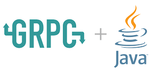

# rRPC with Java pcbook sample project
*  <div style="text-align: center"> <div>

1. Unary
* Implement Unary API with create Laptop feature that allows client to create a new laptop with some specific configurations
* The input of the API is a laptop, and it returns the unquie ID of the created laptop.
* The laptop ID is a UUID, and can be set by the client, or ramdonly generated by the server if it's not provided.

2. Server-Streaming
* Implement Server Streaming API with filter Laptop feature that allows client to search for laptops that satisfies some filtering conditions, such as the maximum price, minimum cores, minimum CPU frequency and minimum RAM.
* The input of the API is the filtering conditions, and it returns a stream of laptops that satisfy the conditions.

3. Client-Streaming
* Implement Client Streaming API with upload image feature that allows client upload one laptop image file to the server. The file will be split into multiple chunks 1kb, and they will be sent to the server as a stream.
* The input of the API is an stream of request, which can either be:
    - Metadata of the image (only the 1st request): which contains the laptopID, and the image type (or file extension) such as ```.jpg``` or ```.png```
    - Or a binary data chunk of image.
* The total size of the image should not exceed 1 MB.

* The API will returns a response that contains the uploaded image ID (random UUID generated by the server) and the total size of the image.

4. Bidirectional-Streaming
* Implement Bidirectional Streaming API with rating features that allows client to rate multiple laptops, each with a score between 1 to 10, and get back the average rating score for each of them.
* The input of the API is a stream of requests, each with a laptop ID and a score.
* The API will returns a stream of responses, each contains a laptopID, the number of times that laptop was rated, and the average rated score.
